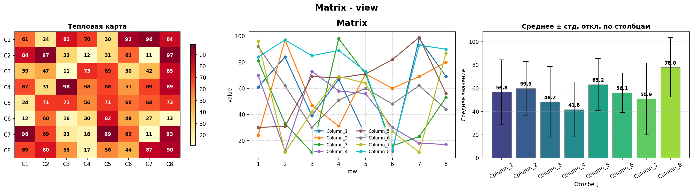

# Создание графиков 
## Pandas | Numpy | Matplotlib

График с рандомными данными

### Документация

- [Pandas](https://pandas.pydata.org/)
- [Numpy](https://numpy.org/)
- [Matplotlib](https://matplotlib.org/)